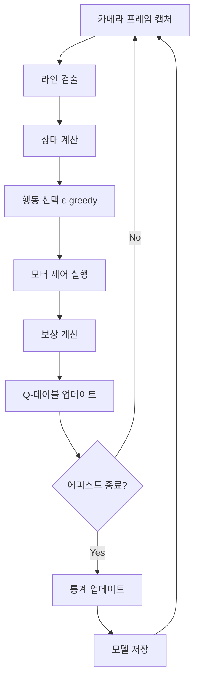

# 🧠 Q-Learning LineTracing System
## 패스파인더 키트 강화학습 기반 라인 트레이싱 자율주행 시스템

[](https://python.org)
[](https://flask.palletsprojects.com)
[](https://opencv.org)
[](https://en.wikipedia.org/wiki/Q-learning)

> **"AI가 스스로 학습하여 완벽한 라인 트레이싱을 마스터하는 과정을 실시간으로 관찰하세요!"**

---

## 🎯 프로젝트 개요

**Q-Learning LineTracing System**은 강화학습 알고리즘을 사용하여 로봇이 스스로 라인 트레이싱을 학습하는 혁신적인 자율주행 시스템입니다. 전통적인 PID 제어와 달리, AI가 시행착오를 통해 최적의 주행 전략을 발견합니다.

### 🌟 핵심 특징

- **🧠 강화학습 기반**: Q-Learning 알고리즘으로 자율 학습
- **📹 실시간 모니터링**: 웹 인터페이스를 통한 학습 과정 시각화
- **🎮 다중 모드**: 학습 모드, 자율주행 모드, 수동 제어 모드
- **📊 학습 분석**: Q-테이블 히트맵, 보상 차트, 성능 통계
- **🔄 모델 관리**: 학습된 모델 저장/로드 기능
- **🌐 하이브리드 환경**: 하드웨어 + 시뮬레이션 모드 지원

---

## 🚀 빠른 시작

### 📋 시스템 요구사항

**하드웨어:**
- Raspberry Pi Zero 2 W (또는 상위 모델)
- 160도 광각 카메라 모듈
- L298N 모터 드라이버
- 기어 DC 모터 × 2개
- 검은색 라인이 있는 흰색 트랙

**소프트웨어:**
- Python 3.7 이상
- Raspberry Pi OS (또는 Ubuntu)
- 웹 브라우저 (Chrome, Firefox, Safari 등)

### ⚡ 설치 및 실행

```bash
# 1. 의존성 설치
pip install -r requirements.txt

# 2. 시스템 실행
python app.py

# 3. 웹 브라우저에서 접속
# http://라즈베리파이IP:5000
```

### 🎮 사용법

1. **시스템 상태 확인**: GPIO 및 카메라 연결 상태 확인
2. **학습 시작**: "학습 시작" 버튼 클릭하여 Q-Learning 시작
3. **학습 모니터링**: 실시간 Q-테이블, 보상 차트, 학습 진행 상황 관찰
4. **자율주행 테스트**: 학습 완료 후 "자율주행 시작"으로 성능 확인
5. **모델 저장**: 만족스러운 성능 달성 시 모델 저장

---

## 🧠 Q-Learning 알고리즘

### 📚 기본 개념

Q-Learning은 **모델 프리 강화학습** 알고리즘으로, 환경과의 상호작용을 통해 최적의 행동 정책을 학습합니다.

```python
Q(s,a) ← Q(s,a) + α[r + γ max Q(s',a') - Q(s,a)]
```

**파라미터:**
- `α (학습률)`: 0.1 - 새로운 정보의 반영 정도
- `γ (할인인수)`: 0.95 - 미래 보상의 중요도
- `ε (탐험률)`: 0.3 → 0.01 - 탐험 vs 활용 균형

### 🎯 상태 공간 (State Space)

라인의 위치에 따라 **7개 상태**로 구분:

```
상태 0: 왼쪽 끝    [■□□□□□□]
상태 1: 왼쪽       [□■□□□□□]
상태 2: 약간 왼쪽  [□□■□□□□]
상태 3: 중앙       [□□□■□□□]  ← 목표 상태
상태 4: 약간 오른쪽 [□□□□■□□]
상태 5: 오른쪽     [□□□□□■□]
상태 6: 오른쪽 끝  [□□□□□□■]
```

### 🎮 행동 공간 (Action Space)

**5가지 행동** 선택 가능:

| 행동 | 이름 | 모터 제어 | 용도 |
|------|------|-----------|------|
| 0 | 좌회전 | 우측 전진, 좌측 후진 | 급격한 방향 전환 |
| 1 | 약간좌 | 우측 100%, 좌측 50% | 부드러운 좌측 조정 |
| 2 | 직진 | 양쪽 100% | 직선 주행 |
| 3 | 약간우 | 우측 50%, 좌측 100% | 부드러운 우측 조정 |
| 4 | 우회전 | 우측 후진, 좌측 전진 | 급격한 방향 전환 |

### 🏆 보상 시스템 (Reward System)

```python
보상 = {
    중앙 상태 (3): +15점      # 최고 보상
    라인 위 (1,2,4,5): +10점  # 기본 보상
    라인 끝 (0,6): +5점       # 낮은 보상
    라인 이탈: -5점           # 페널티
}
```

---

## 📊 웹 인터페이스 기능

### 🎛️ 제어 패널

**Q-Learning 학습:**
- 🟢 학습 시작/중지
- 🔄 학습 초기화
- 📊 실시간 학습 상태 모니터링

**자율주행:**
- 🤖 자율주행 시작/중지
- 📈 신뢰도 및 성능 지표 표시

**수동 제어:**
- ⬆️ 전진
- ⬅️ 좌회전
- ➡️ 우회전
- ⏹️ 정지

**모델 관리:**
- 💾 모델 저장
- 📂 모델 로드

### 📈 실시간 모니터링

**시스템 상태:**
- 🔌 GPIO 연결 상태
- 📷 카메라 연결 상태
- 🧠 학습 진행 상태
- 🚗 자율주행 상태

**학습 통계:**
- 📊 에피소드 수
- 👣 총 스텝 수
- 🎯 성공률
- 🔍 현재 탐험률 (ε)

**Q-테이블 히트맵:**
- 🌈 색상으로 Q값 시각화
- 🔥 빨간색: 음수 Q값 (피해야 할 행동)
- 🟢 초록색: 양수 Q값 (선호하는 행동)

**학습 진행 차트:**
- 📈 에피소드별 보상 변화
- 📊 학습 성능 추이 분석

---

## 🔧 시스템 아키텍처

### 📁 파일 구조

```
6. QLearning_LineTracing/
├── app.py                 # 메인 애플리케이션
├── templates/
│   └── index.html        # 웹 인터페이스
├── requirements.txt      # 의존성 패키지
├── README.md            # 사용 가이드
└── q_learning_model.json # 저장된 모델 (자동 생성)
```

### 🧩 주요 컴포넌트

**QLearningConfig 클래스:**
- 학습 파라미터 관리
- 상태/행동 공간 정의
- 보상 시스템 설정

**QLearningAgent 클래스:**
- Q-테이블 관리
- ε-greedy 정책 구현
- 학습 알고리즘 실행

**컴퓨터 비전 모듈:**
- 실시간 라인 검출
- 이미지 전처리
- 상태 변환

**모터 제어 시스템:**
- GPIO 기반 모터 제어
- 행동 → 모터 명령 변환
- 안전 정지 기능

### 🔄 학습 프로세스



---

## 📚 학습 가이드

### 🎓 초보자를 위한 학습 단계

**1단계: 시스템 이해 (1-2일)**
- Q-Learning 기본 개념 학습
- 웹 인터페이스 탐색
- 시뮬레이션 모드에서 실험

**2단계: 기본 학습 (3-5일)**
- 간단한 직선 트랙에서 학습 시작
- Q-테이블 변화 관찰
- 보상 시스템 이해

**3단계: 고급 학습 (1-2주)**
- 복잡한 트랙 도전
- 파라미터 튜닝 실험
- 성능 최적화

**4단계: 마스터 레벨 (2-4주)**
- 커스텀 보상 시스템 설계
- 다중 에이전트 실험
- 실제 경진대회 참가

### 🔧 파라미터 튜닝 가이드

**학습률 (α) 조정:**
```python
α = 0.05  # 느린 학습, 안정적
α = 0.1   # 기본값, 균형적
α = 0.2   # 빠른 학습, 불안정할 수 있음
```

**탐험률 (ε) 전략:**
```python
# 보수적 탐험
epsilon_start = 0.2
epsilon_decay = 0.999

# 적극적 탐험
epsilon_start = 0.5
epsilon_decay = 0.995
```

**보상 시스템 커스터마이징:**
```python
# 중앙 집중형
reward_center = 20
reward_on_line = 5

# 균형형
reward_center = 15
reward_on_line = 10
```

---

## 🚀 고급 활용

### 🎯 성능 최적화

**1. 트랙 설계:**
- 명확한 검은색 라인 (폭: 2-3cm)
- 균일한 조명 환경
- 적절한 곡률 반경

**2. 카메라 설정:**
- 적절한 높이 (15-20cm)
- 안정적인 마운팅
- 렌즈 청소 및 관리

**3. 학습 전략:**
- 점진적 난이도 증가
- 다양한 트랙에서 학습
- 정기적인 모델 백업

### 🔬 실험 아이디어

**기본 실험:**
- 다양한 학습률 비교
- 탐험률 감소 전략 비교
- 보상 시스템 변경 효과

**고급 실험:**
- 다중 에이전트 학습
- 전이 학습 (Transfer Learning)
- 하이브리드 제어 (Q-Learning + PID)

**연구 프로젝트:**
- 딥 Q-네트워크 (DQN) 구현
- 정책 경사 방법 비교
- 실제 환경 vs 시뮬레이션 성능 분석

---

## 🛠️ 문제 해결

### ❓ 자주 묻는 질문

**Q: 학습이 너무 느려요.**
A: 학습률을 0.15로 증가시키고, 탐험률 감소를 빠르게 설정해보세요.

**Q: 로봇이 라인을 계속 놓쳐요.**
A: 카메라 높이와 각도를 조정하고, 조명을 개선해보세요.

**Q: Q-테이블이 수렴하지 않아요.**
A: 에피소드 길이를 늘리고, 할인인수를 0.9로 낮춰보세요.

**Q: 웹 인터페이스가 느려요.**
A: 프레임 전송 빈도를 줄이고, 이미지 품질을 낮춰보세요.

### 🔧 일반적인 문제

**카메라 관련:**
```bash
# 카메라 권한 확인
sudo usermod -a -G video $USER

# 카메라 모듈 활성화
sudo raspi-config
# → Interface Options → Camera → Enable
```

**GPIO 관련:**
```bash
# GPIO 권한 확인
sudo usermod -a -G gpio $USER

# GPIO 상태 확인
gpio readall
```

**성능 관련:**
```bash
# CPU 사용률 확인
htop

# 메모리 사용률 확인
free -h

# 온도 확인
vcgencmd measure_temp
```

---

## 📈 성능 벤치마크

### 🏆 학습 성능 지표

**초급 수준 (1-10 에피소드):**
- 평균 보상: -50 ~ 0
- 성공률: 0-20%
- 라인 추적 시간: 5-15초

**중급 수준 (10-50 에피소드):**
- 평균 보상: 0 ~ 100
- 성공률: 20-60%
- 라인 추적 시간: 15-30초

**고급 수준 (50+ 에피소드):**
- 평균 보상: 100 ~ 200
- 성공률: 60-90%
- 라인 추적 시간: 30초 이상

**마스터 수준 (100+ 에피소드):**
- 평균 보상: 200+
- 성공률: 90%+
- 완벽한 라인 추적

### 📊 비교 분석

| 방법 | 학습 시간 | 성능 | 적응성 | 구현 난이도 |
|------|-----------|------|--------|-------------|
| PID 제어 | 즉시 | 높음 | 낮음 | 중간 |
| Q-Learning | 중간 | 높음 | 높음 | 높음 |
| 딥러닝 | 오래 | 매우 높음 | 매우 높음 | 매우 높음 |

---

## 🤝 기여하기

### 💡 기여 방법

1. **이슈 리포트**: 버그나 개선사항 제안
2. **코드 기여**: 새로운 기능이나 최적화
3. **문서 개선**: 사용법이나 예제 추가
4. **테스트**: 다양한 환경에서 테스트

### 📝 개발 가이드라인

- **코드 스타일**: PEP 8 준수
- **주석**: 한국어로 상세히 작성
- **테스트**: 새 기능에 대한 테스트 코드 포함
- **문서**: 변경사항에 대한 문서 업데이트

---

## 📄 라이선스

이 프로젝트는 **MIT 라이선스** 하에 배포됩니다.

---

## 🙏 감사의 말

- **OpenCV 커뮤니티**: 강력한 컴퓨터 비전 라이브러리
- **Flask 개발팀**: 훌륭한 웹 프레임워크
- **NumPy 프로젝트**: 효율적인 수치 연산
- **Raspberry Pi Foundation**: 혁신적인 교육 플랫폼

---

## 📞 지원 및 문의

- **GitHub Issues**: 버그 리포트 및 기능 요청
- **이메일**: pathfinder-support@example.com
- **커뮤니티**: [패스파인더 키트 포럼](https://pathfinder-kit.github.io)

---

<div align="center">

## 🚀 **Q-Learning으로 AI 자율주행의 미래를 경험해보세요!**

**"기계가 스스로 학습하는 놀라운 순간을 목격하세요"**

[](https://github.com/pathfinder-kit/qlearning-linetracing)

</div> 